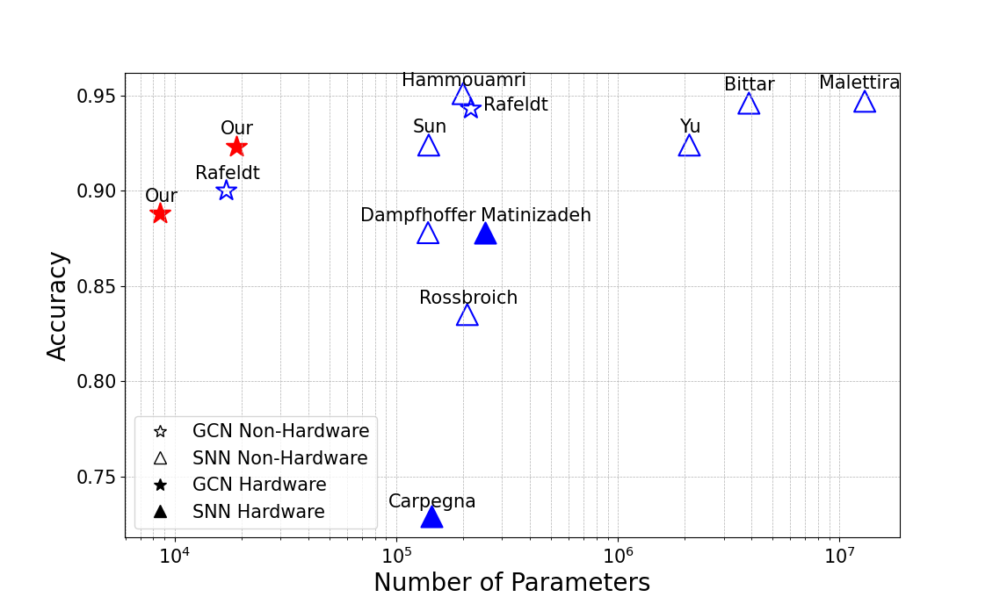
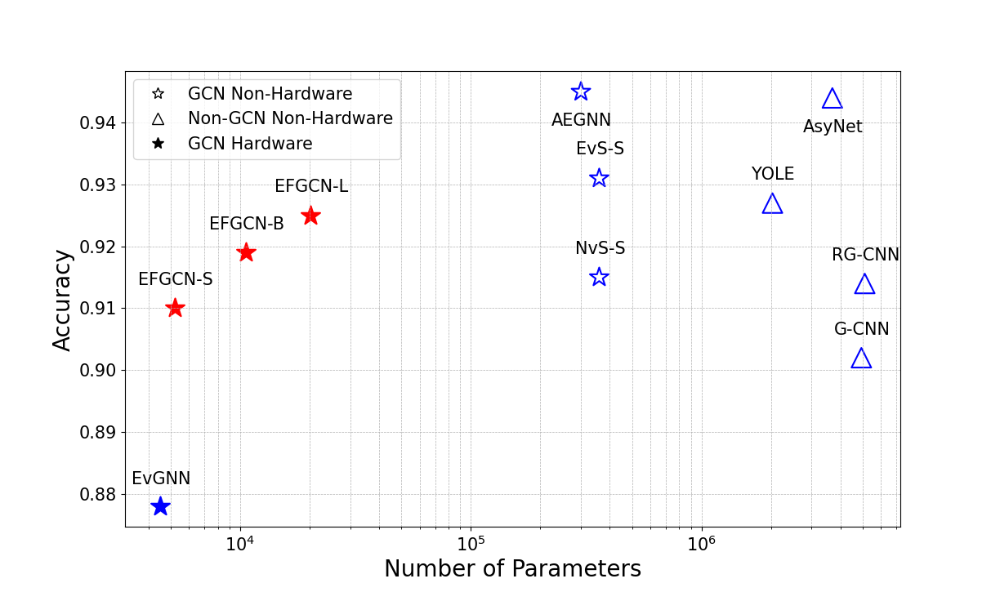

# Neuromorphic Sensors

Neuromorphic sensors, such as event-based cameras, mimic the behavior of biological visual systems by transmitting information through asynchronous “spikes.” Instead of providing full image frames at a constant rate, they capture changes in the scene at the pixel level, leading to highly efficient and sparse data. These properties enable low-latency and power-efficient vision processing, making neuromorphic sensors ideal for applications in robotics, embedded systems, and edge computing.

## Introduction to GCNs

Graph Convolutional Networks (GCNs) extend neural network-based modeling to graph-structured data. While traditional convolutional neural networks (CNNs) excel at processing grid-like data (e.g., images, time series), GCNs operate on non-Euclidean domains, capturing relationships between nodes (features) connected by edges. In the context of event-based (neuromorphic) data, each event can be considered a node, and connections (edges) represent spatio-temporal correlations between events.

### Integrating GCNs with SoC FPGAs

System-on-Chip Field-Programmable Gate Arrays (SoC FPGAs) combine a programmable logic fabric with a processor system (often ARM-based), enabling both hardware acceleration and software programmability on a single device. By offloading computationally intensive operations—like graph convolutions—to dedicated hardware accelerators, we can achieve:

- **Real-time performance** even on high-throughput event streams.  
- **Low latency** by processing data locally without transferring to external servers or GPUs.  
- **Energy efficiency** due to the inherent parallelism and customizability of FPGA-based designs.

Our research explores memory-efficient and scalable GCN implementations specifically tailored for event-based vision. We optimize data structures and graph representations to leverage the parallel nature of FPGAs while minimizing on-chip resource usage.

### Results

Our preliminary results show that:
1. **Real-time Processing:** We achieve near real-time frame rates for event-based classification tasks.  
2. **Resource Efficiency:** Optimized graph representations reduce memory overhead and logic utilization, making them suitable for mid-range SoC FPGAs.  
3. **High Accuracy:** GCNs consistently outperform traditional frame-based methods when processing sparse and asynchronous neuromorphic data, providing robust recognition in challenging scenarios.  






More details on the experiments, performance metrics, and hardware resource usage can be found in our publications listed below.

---

## People

Below are all the people involved in this project:

| Name               | Institution                        | Email                         |
|--------------------|------------------------------------|-------------------------------|
| Kamil Jeziorek     | AGH University of Krakow           | kjeziorek@agh.edu.pl          |
| Piotr Wzorek       | AGH University of Krakow           | pwzorek@agh.edu.pl            |
| Krzysztof Błachut  | AGH University of Krakow           | kblachut@agh.edu.pl           |
| Tomasz Kryjak      | AGH University of Krakow           | kryjak@agh.edu.pl             |
| Manon Dampfhoffer  | Univ. Grenoble Alpes, CEA, List    | Manon.DAMPFHOFFER@cea.fr      |
| Thomas Dalgaty     | Univ. Grenoble Alpes, CEA, List    | Thomas.DALGATY@cea.fr         |
| Thomas Mesquida    | Univ. Grenoble Alpes, CEA, List    | thomas.mesquida@cea.fr        |
| Hiroshi Nakano     | Keio University, Yokohama, Japan   | nakano@west.sd.keio.ac.jp     |
| Hiroaki Nishi      | Keio University, Yokohama, Japan   | west@keio.jp                  |
| Andrea Pinna       | Sorbonne Universite, CNRS, LIP6, Paris, France | andrea.pinna@lip6.fr |

Feel free to reach out to any of us for more details regarding our ongoing research.

---

## Publications & Citations

If you find this work interesting, check out our publications:

1. **Memory-efficient graph convolutional networks for object classification and detection with event cameras**  
   ```bibtex
   @inproceedings{jeziorek2023memory,
     title={Memory-efficient graph convolutional networks for object classification and detection with event cameras},
     author={Jeziorek, Kamil and Pinna, Andrea and Kryjak, Tomasz},
     booktitle={2023 Signal Processing: Algorithms, Architectures, Arrangements, and Applications (SPA)},
     pages={160--165},
     year={2023},
     organization={IEEE}
   }
   ```

2. **Optimising graph representation for hardware implementation of graph convolutional networks for event-based vision**  
   ```bibtex
   @inproceedings{jeziorek2024optimising,
     title={Optimising graph representation for hardware implementation of graph convolutional networks for event-based vision},
     author={Jeziorek, Kamil and Wzorek, Piotr and Blachut, Krzysztof and Pinna, Andrea and Kryjak, Tomasz},
     booktitle={International Workshop on Design and Architecture for Signal and Image Processing},
     pages={110--122},
     year={2024},
     organization={Springer}
   }
   ```

3. **Embedded Graph Convolutional Networks for Real-Time Event Data Processing on SoC FPGAs**  
   ```bibtex
   @article{jeziorek2024embedded,
     title={Embedded Graph Convolutional Networks for Real-Time Event Data Processing on SoC FPGAs},
     author={Jeziorek, Kamil and Wzorek, Piotr and Blachut, Krzysztof and Pinna, Andrea and Kryjak, Tomasz},
     journal={arXiv preprint arXiv:2406.07318},
     year={2024}
   }
   ```

4. **Increasing the scalability of graph convolution for FPGA-implemented event-based vision**  
   ```bibtex
   @article{wzorek2024increasing,
     title={Increasing the scalability of graph convolution for FPGA-implemented event-based vision},
     author={Wzorek, Piotr and Jeziorek, Kamil and Kryjak, Tomasz and Pinna, Andrea},
     journal={arXiv preprint arXiv:2411.04269},
     year={2024}
   }
   ```

For more detailed insights and experimental data, please refer to the above publications.