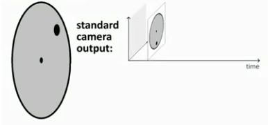
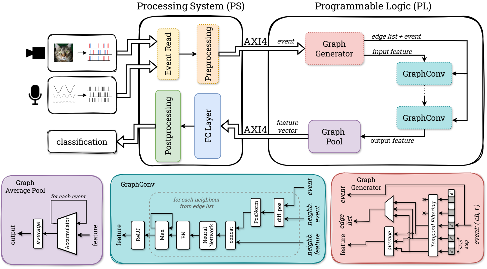

# Contact

If you are interested in this work, please contact **Kamil Jeziorek**:

<kjeziorek@agh.edu.pl>

or one of the co-workers listed at the bottom of the page.

# Neuromorphic Sensors

Neuromorphic sensors, such as event-based cameras and dynamic audio sensors (DAS), mimic the behavior of biological sensory systems by transmitting information through asynchronous “spikes.” Instead of providing continuous frames or signals at a constant rate, they capture **changes** in the scene or audio signal at the sensor level. This leads to highly efficient and sparse data representation, enabling low-latency and power-efficient processing—ideal for applications in robotics, embedded systems, and edge computing.

## Event-Based (DVS) Cameras

Event-based cameras (also referred to as Dynamic Vision Sensors, DVS) capture changes in brightness at each pixel independently. Rather than producing full images at a set frame rate, each pixel fires an event whenever it detects a significant change in intensity. 



## Dynamic Audio Sensors (DAS)

Dynamic Audio Sensors (DAS) operate on a similar neuromorphic principle but for acoustic signals. Instead of sampling at a fixed rate like traditional microphones, DAS devices output spike-like events in response to changes in sound pressure or other relevant audio features.

Just as with event-based cameras, the sparse and asynchronous output of DAS is well-suited for graph-based representations, where each event can be considered a node connected by edges that capture temporal or spectral relationships.


## Introduction to GCNs

Graph Convolutional Networks (GCNs) extend neural network-based modeling to graph-structured data. While traditional Convolutional Neural Networks (CNNs) excel at processing grid-like data (e.g., images, time series), GCNs operate on non-Euclidean domains, capturing relationships between nodes (features) connected by edges.  

In the context of **event-based (neuromorphic) data**—from both DVS cameras and DAS—each event can be considered a node, and connections (edges) represent spatio-temporal or spectro-temporal correlations between events.

### Integrating GCNs with SoC FPGAs

System-on-Chip Field-Programmable Gate Arrays (SoC FPGAs) combine a programmable logic fabric with a processor system (often ARM-based), enabling both hardware acceleration and software programmability on a single device. By offloading computationally intensive operations—like graph convolutions—to dedicated hardware accelerators, we can achieve:

- **Real-time performance** even on high-throughput event/audio streams.  
- **Low latency** by processing data locally without the need to transfer large amounts of data to external servers or GPUs.  
- **Energy efficiency** due to the inherent parallelism and customizability of FPGA-based designs.




Our research explores **memory-efficient and scalable GCN implementations** specifically tailored for neuromorphic data. We optimize data structures and graph representations to leverage the parallel nature of FPGAs while minimizing on-chip resource usage.

### Results

Our preliminary results show that:

1. **Real-time Processing:** We achieve near real-time performance for event-based classification tasks (both visual and audio).  
2. **Resource Efficiency:** Optimized graph representations reduce memory overhead and logic utilization, making them suitable for mid-range SoC FPGAs.  
3. **High Accuracy:** GCNs consistently outperform traditional frame-based or continuous-sampling methods when processing sparse, asynchronous neuromorphic data, providing robust recognition in challenging scenarios.   


Our work was also awarded during AMD Open Hardware Design Competition. 

<https://www.openhw.eu/2024>

[](https://www.youtube.com/watch?v=w8-i1E3F-jE)


More details on the experiments, performance metrics, and hardware resource usage can be found in our publications listed below.

---

## People

Below are all the people involved in this project:

| Name               | Institution                        | Email                         |
|--------------------|------------------------------------|-------------------------------|
| Kamil Jeziorek     | AGH University of Krakow           | kjeziorek@agh.edu.pl          |
| Piotr Wzorek       | AGH University of Krakow           | pwzorek@agh.edu.pl            |
| Krzysztof Błachut  | AGH University of Krakow           | kblachut@agh.edu.pl           |
| Tomasz Kryjak      | AGH University of Krakow           | kryjak@agh.edu.pl             |
| Manon Dampfhoffer  | Univ. Grenoble Alpes, CEA, List    | Manon.DAMPFHOFFER@cea.fr      |
| Thomas Dalgaty     | Univ. Grenoble Alpes, CEA, List    | Thomas.DALGATY@cea.fr         |
| Thomas Mesquida    | Univ. Grenoble Alpes, CEA, List    | thomas.mesquida@cea.fr        |
| Hiroshi Nakano     | Keio University, Yokohama, Japan   | nakano@west.sd.keio.ac.jp     |
| Hiroaki Nishi      | Keio University, Yokohama, Japan   | west@keio.jp                  |
| Andrea Pinna       | Sorbonne Universite, CNRS, LIP6, Paris, France | andrea.pinna@lip6.fr |

Feel free to reach out to any of us for more details regarding our ongoing research.

---


## Publications & Citations

If you find this work interesting, check out our publications:

1. **Memory-efficient graph convolutional networks for object classification and detection with event cameras**  
   ```bibtex
   @inproceedings{jeziorek2023memory,
     title={Memory-efficient graph convolutional networks for object classification and detection with event cameras},
     author={Jeziorek, Kamil and Pinna, Andrea and Kryjak, Tomasz},
     booktitle={2023 Signal Processing: Algorithms, Architectures, Arrangements, and Applications (SPA)},
     pages={160--165},
     year={2023},
     organization={IEEE}
   }
   ```

2. **Optimising graph representation for hardware implementation of graph convolutional networks for event-based vision**  
   ```bibtex
   @inproceedings{jeziorek2024optimising,
     title={Optimising graph representation for hardware implementation of graph convolutional networks for event-based vision},
     author={Jeziorek, Kamil and Wzorek, Piotr and Blachut, Krzysztof and Pinna, Andrea and Kryjak, Tomasz},
     booktitle={International Workshop on Design and Architecture for Signal and Image Processing},
     pages={110--122},
     year={2024},
     organization={Springer}
   }
   ```

3. **Embedded Graph Convolutional Networks for Real-Time Event Data Processing on SoC FPGAs**  
   ```bibtex
   @article{jeziorek2024embedded,
     title={Embedded Graph Convolutional Networks for Real-Time Event Data Processing on SoC FPGAs},
     author={Jeziorek, Kamil and Wzorek, Piotr and Blachut, Krzysztof and Pinna, Andrea and Kryjak, Tomasz},
     journal={arXiv preprint arXiv:2406.07318},
     year={2024}
   }
   ```

4. **Increasing the scalability of graph convolution for FPGA-implemented event-based vision**  
   ```bibtex
   @article{wzorek2024increasing,
     title={Increasing the scalability of graph convolution for FPGA-implemented event-based vision},
     author={Wzorek, Piotr and Jeziorek, Kamil and Kryjak, Tomasz and Pinna, Andrea},
     journal={arXiv preprint arXiv:2411.04269},
     year={2024}
   }
   ```

For more detailed insights and experimental data, please refer to the above publications.